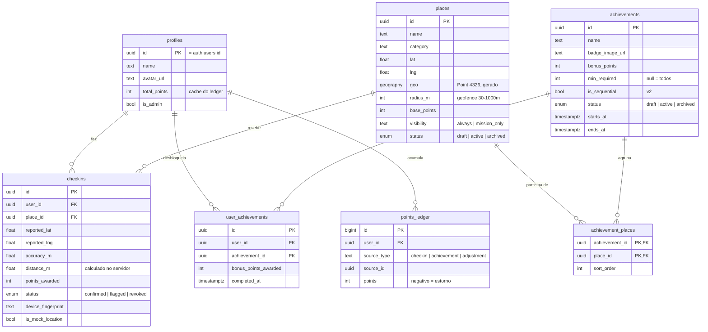

# 01 — Modelagem de Dados

PostgreSQL + PostGIS (Supabase). Sete tabelas de domínio. A regra central do modelo:
**o check-in referencia só o Local** — o vínculo com Conquistas é resolvido via junção
`achievement_places`, então um único check-in pontua para todas as missões que contêm aquele Local.

## ERD



## Justificativas por tabela

### `places` — o Local é a unidade atômica
- `geo` é coluna **gerada** a partir de `lat`/`lng` (`geography(Point, 4326)`) com índice **GIST** — buscas "o que há neste viewport" e validação `ST_DWithin` ficam O(log n). `lat`/`lng` continuam como colunas simples porque o app consome número puro.
- `radius_m` por Local (default 100 m): um mirante aceita 300 m, uma estátua exige 50 m. Limites `CHECK (30..1000)` evitam erro de cadastro (raio 0 = ninguém consegue; raio 50 km = fraude trivial).
- `visibility = 'mission_only'` permite Local que só aparece no contexto da missão (ex.: etapa "secreta" de uma trilha), sem card avulso na Home.
- `status` com ciclo `draft → active → archived`: o app **só lê `active`** (garantido por RLS). Nunca há DELETE físico de Local com check-ins (FK `on delete restrict` em `checkins`).

### `achievements` + `achievement_places` — Conquista é agrupador, não dono
- **N:N**: um Local pode estar em várias missões; remover o vínculo não apaga o Local nem os check-ins.
- `min_required = NULL` ⇒ exige todos os Locais; `min_required = 5` com 8 Locais ⇒ "complete 5 de 8" (v2, mas o modelo já nasce pronto).
- `sort_order` + `is_sequential` preparam trilhas ordenadas (v2) sem migração.
- `starts_at`/`ends_at` viabilizam missões sazonais ("Festival de Inverno").

### `checkins` — evento auditável, não um booleano
Cada linha guarda o que o cliente **alegou** (`reported_lat/lng`, `accuracy_m`, `device_fingerprint`, `is_mock_location`) e o que o servidor **verificou** (`distance_m`, `status`). Isso é o insumo da revisão de fraude.

```sql
-- 1 check-in válido por usuário+local; revogados não bloqueiam nova tentativa
create unique index uq_checkins_user_place
  on checkins (user_id, place_id) where status <> 'revoked';
```

O índice único parcial é o que dá **idempotência** ao endpoint (retry de rede não duplica pontos) e já suporta o futuro check-in repetível: basta trocar o predicado por janela de tempo.

### `points_ledger` — fonte da verdade do score
Todo ponto entra/sai por aqui (`checkin`, `achievement`, `adjustment`). Estorno de fraude = linha negativa, nunca UPDATE/DELETE do histórico. Um trigger mantém `profiles.total_points` sincronizado (leitura O(1) para Home e leaderboard).

### `user_achievements` — conclusão materializada
A conclusão é **materializada** (não recalculada a cada leitura) e a constraint `unique (user_id, achievement_id)` é o que resolve a corrida de "dois check-ins simultâneos completam a missão duas vezes" — só a transação cujo INSERT vencer concede o bônus.

## DDL completo

```sql
create extension if not exists postgis;

create type place_status        as enum ('draft', 'active', 'archived');
create type achievement_status  as enum ('draft', 'active', 'archived');
create type checkin_status      as enum ('confirmed', 'flagged', 'revoked');

-- ───────────────────────── profiles ─────────────────────────
create table public.profiles (
  id            uuid primary key references auth.users (id) on delete cascade,
  name          text,
  avatar_url    text,
  total_points  int not null default 0,
  is_admin      boolean not null default false,
  created_at    timestamptz not null default now()
);

-- ───────────────────────── places ───────────────────────────
create table public.places (
  id            uuid primary key default gen_random_uuid(),
  name          text not null,
  description   text,
  category      text,                  -- 'gastronomia' | 'historico' | 'natureza' | ...
  photo_url     text,
  address       text,
  city          text,
  lat           double precision not null,
  lng           double precision not null,
  geo           geography(point, 4326) generated always as
                  (st_setsrid(st_makepoint(lng, lat), 4326)::geography) stored,
  radius_m      int not null default 100 check (radius_m between 30 and 1000),
  base_points   int not null default 10 check (base_points >= 0),
  visibility    text not null default 'always'
                  check (visibility in ('always', 'mission_only')),
  status        place_status not null default 'draft',
  created_by    uuid references public.profiles (id),
  created_at    timestamptz not null default now(),
  updated_at    timestamptz not null default now()
);
create index idx_places_geo    on public.places using gist (geo);
create index idx_places_status on public.places (status) where status = 'active';

-- ─────────────────────── achievements ───────────────────────
create table public.achievements (
  id               uuid primary key default gen_random_uuid(),
  name             text not null,
  description      text,
  cover_image_url  text,
  badge_image_url  text,
  bonus_points     int not null default 0 check (bonus_points >= 0),
  min_required     int,               -- null = todos os locais
  is_sequential    boolean not null default false,
  status           achievement_status not null default 'draft',
  starts_at        timestamptz,
  ends_at          timestamptz,
  city             text,
  created_by       uuid references public.profiles (id),
  created_at       timestamptz not null default now(),
  updated_at       timestamptz not null default now(),
  check (ends_at is null or starts_at is null or ends_at > starts_at)
);

create table public.achievement_places (
  achievement_id uuid not null references public.achievements (id) on delete cascade,
  place_id       uuid not null references public.places (id) on delete restrict,
  sort_order     int not null default 0,
  primary key (achievement_id, place_id)
);
create index idx_achievement_places_place on public.achievement_places (place_id);

-- ───────────────────────── checkins ─────────────────────────
create table public.checkins (
  id                 uuid primary key default gen_random_uuid(),
  user_id            uuid not null references public.profiles (id) on delete cascade,
  place_id           uuid not null references public.places (id) on delete restrict,
  reported_lat       double precision not null,
  reported_lng       double precision not null,
  accuracy_m         double precision,
  distance_m         double precision not null,   -- ST_Distance calculado no servidor
  points_awarded     int not null default 0,
  status             checkin_status not null default 'confirmed',
  device_fingerprint text,
  is_mock_location   boolean not null default false,
  created_at         timestamptz not null default now()
);
create unique index uq_checkins_user_place
  on public.checkins (user_id, place_id) where status <> 'revoked';
create index idx_checkins_user  on public.checkins (user_id, created_at desc);
create index idx_checkins_flag  on public.checkins (status) where status = 'flagged';

-- ──────────────────── user_achievements ─────────────────────
create table public.user_achievements (
  id                    uuid primary key default gen_random_uuid(),
  user_id               uuid not null references public.profiles (id) on delete cascade,
  achievement_id        uuid not null references public.achievements (id) on delete cascade,
  bonus_points_awarded  int not null default 0,
  completed_at          timestamptz not null default now(),
  unique (user_id, achievement_id)
);

-- ────────────────────── points_ledger ───────────────────────
create table public.points_ledger (
  id           bigint generated always as identity primary key,
  user_id      uuid not null references public.profiles (id) on delete cascade,
  source_type  text not null check (source_type in ('checkin', 'achievement', 'adjustment')),
  source_id    uuid,
  points       int not null,            -- negativo = estorno
  description  text,
  created_at   timestamptz not null default now()
);
create index idx_ledger_user on public.points_ledger (user_id, created_at desc);

-- Trigger: ledger → cache de pontos no perfil
create or replace function public.apply_ledger_to_profile()
returns trigger language plpgsql as $$
begin
  update public.profiles
     set total_points = total_points + new.points
   where id = new.user_id;
  return new;
end $$;

create trigger trg_ledger_apply
  after insert on public.points_ledger
  for each row execute function public.apply_ledger_to_profile();
```

## Função transacional de check-in (coração do sistema)

Toda escrita de check-in passa por esta RPC (`SECURITY DEFINER`) — o cliente **não tem**
INSERT em `checkins`, `points_ledger` nem `user_achievements`. Uma única transação:
valida geofence, aplica antifraude, insere o check-in, credita pontos e resolve
desbloqueio de conquistas.

```sql
create or replace function public.perform_checkin(
  p_place_id           uuid,
  p_lat                double precision,
  p_lng                double precision,
  p_accuracy_m         double precision default null,
  p_device_fingerprint text default null,
  p_is_mock_location   boolean default false
) returns jsonb
language plpgsql
security definer
set search_path = public
as $$
declare
  v_user        uuid := auth.uid();
  v_place       places%rowtype;
  v_point       geography;
  v_distance    double precision;
  v_tolerance   double precision;
  v_status      checkin_status := 'confirmed';
  v_checkin     checkins%rowtype;
  v_last        record;
  v_speed_kmh   double precision;
  v_progress    jsonb := '[]'::jsonb;
  v_ach         record;
  v_done        int;
  v_needed      int;
  v_unlocked    boolean;
begin
  if v_user is null then
    raise exception 'UNAUTHENTICATED' using errcode = '28000';
  end if;

  select * into v_place from places where id = p_place_id;

  -- 1. Local precisa existir e estar ativo
  if not found or v_place.status <> 'active' then
    raise exception 'PLACE_NOT_AVAILABLE' using errcode = 'P0001';
  end if;

  -- 2. Precisão de GPS inaceitável → nem dá para validar o raio
  if p_accuracy_m is not null and p_accuracy_m > 100 then
    raise exception 'LOW_GPS_ACCURACY' using errcode = 'P0002';
  end if;

  -- 3. Geofence: autoridade é o servidor (ST_DWithin via índice GIST).
  --    Tolerância = raio + min(accuracy, 50m) absorve imprecisão legítima de GPS urbano.
  v_point     := st_setsrid(st_makepoint(p_lng, p_lat), 4326)::geography;
  v_distance  := st_distance(v_place.geo, v_point);
  v_tolerance := v_place.radius_m + least(coalesce(p_accuracy_m, 0), 50);

  if v_distance > v_tolerance then
    raise exception 'OUT_OF_RANGE|%|%', round(v_distance), v_place.radius_m
      using errcode = 'P0003';
  end if;

  -- 4. Viagem impossível: distância/tempo desde o último check-in > 900 km/h
  --    Sinal "soft": não rejeita, marca para revisão (D8).
  select c.created_at, p.geo into v_last
    from checkins c join places p on p.id = c.place_id
   where c.user_id = v_user and c.status <> 'revoked'
   order by c.created_at desc limit 1;

  if found then
    v_speed_kmh := (st_distance(v_last.geo, v_point) / 1000.0)
                   / greatest(extract(epoch from (now() - v_last.created_at)) / 3600.0, 0.001);
    if v_speed_kmh > 900 then
      v_status := 'flagged';
    end if;
  end if;

  if p_is_mock_location then
    v_status := 'flagged';
  end if;

  -- 5. Insere o check-in. O índice único parcial garante idempotência:
  --    retry de rede ou duplo clique caem no conflito.
  begin
    insert into checkins (user_id, place_id, reported_lat, reported_lng, accuracy_m,
                          distance_m, points_awarded, status, device_fingerprint,
                          is_mock_location)
    values (v_user, p_place_id, p_lat, p_lng, p_accuracy_m,
            v_distance, v_place.base_points, v_status, p_device_fingerprint,
            p_is_mock_location)
    returning * into v_checkin;
  exception when unique_violation then
    raise exception 'ALREADY_CHECKED_IN' using errcode = 'P0004';
  end;

  -- 6. Credita pontos do Local (mesmo flagged: otimista + revogável, decisão D8)
  insert into points_ledger (user_id, source_type, source_id, points, description)
  values (v_user, 'checkin', v_checkin.id, v_place.base_points,
          'Check-in: ' || v_place.name);

  -- 7. Para cada Conquista ativa que contém este Local: recalcula progresso
  --    e desbloqueia se completou. O ON CONFLICT DO NOTHING + verificação de
  --    FOUND tornam o desbloqueio à prova de corrida (só uma transação ganha).
  for v_ach in
    select a.*
      from achievement_places ap
      join achievements a on a.id = ap.achievement_id
     where ap.place_id = p_place_id
       and a.status = 'active'
       and (a.starts_at is null or a.starts_at <= now())
       and (a.ends_at   is null or a.ends_at   >= now())
  loop
    select count(*) into v_done
      from achievement_places ap
      join checkins c on c.place_id = ap.place_id
                     and c.user_id = v_user
                     and c.status <> 'revoked'
     where ap.achievement_id = v_ach.id;

    select coalesce(v_ach.min_required, count(*)) into v_needed
      from achievement_places where achievement_id = v_ach.id;

    v_unlocked := false;
    if v_done >= v_needed
       and not exists (select 1 from user_achievements
                        where user_id = v_user and achievement_id = v_ach.id) then
      insert into user_achievements (user_id, achievement_id, bonus_points_awarded)
      values (v_user, v_ach.id, v_ach.bonus_points)
      on conflict (user_id, achievement_id) do nothing;

      if found then
        v_unlocked := true;
        if v_ach.bonus_points > 0 then
          insert into points_ledger (user_id, source_type, source_id, points, description)
          values (v_user, 'achievement', v_ach.id, v_ach.bonus_points,
                  'Conquista: ' || v_ach.name);
        end if;
      end if;
    end if;

    v_progress := v_progress || jsonb_build_object(
      'achievement_id',  v_ach.id,
      'name',            v_ach.name,
      'completed',       v_done,
      'total',           v_needed,
      'newly_unlocked',  v_unlocked,
      'bonus_points',    case when v_unlocked then v_ach.bonus_points else 0 end
    );
  end loop;

  return jsonb_build_object(
    'checkin', jsonb_build_object(
      'id', v_checkin.id, 'place_id', p_place_id,
      'points_awarded', v_place.base_points,
      'status', v_status, 'created_at', v_checkin.created_at
    ),
    'validation', jsonb_build_object(
      'distance_m', round(v_distance), 'radius_m', v_place.radius_m
    ),
    'achievements_progress', v_progress,
    'user', (select jsonb_build_object('total_points', total_points)
               from profiles where id = v_user)
  );
end $$;
```

## RLS (resumo de políticas)

| Tabela | App (usuário autenticado) | Admin |
|---|---|---|
| `places` | `SELECT` apenas `status = 'active'` | CRUD total (via service role / política `is_admin`) |
| `achievements` / `achievement_places` | `SELECT` apenas `status = 'active'` e dentro da janela | CRUD total |
| `checkins` | `SELECT` apenas `user_id = auth.uid()`; **sem INSERT direto** (só via RPC) | `SELECT` total, `UPDATE status` (revogação via RPC própria) |
| `user_achievements` | `SELECT` apenas próprios | `SELECT` total |
| `points_ledger` | `SELECT` apenas próprios | `SELECT` total, `INSERT` de `adjustment` via RPC |
| `profiles` | `SELECT`/`UPDATE` próprio (campos de perfil; nunca `total_points`/`is_admin`) | `SELECT` total |

## Consultas canônicas

**Progresso de um usuário em todas as missões ativas** (Home):

```sql
select a.id, a.name, a.badge_image_url, a.bonus_points,
       count(ap.place_id)                                   as total_places,
       coalesce(a.min_required, count(ap.place_id))         as needed,
       count(c.id)                                          as completed,
       (ua.id is not null)                                  as unlocked
  from achievements a
  join achievement_places ap on ap.achievement_id = a.id
  left join checkins c  on c.place_id = ap.place_id
                       and c.user_id = $1 and c.status <> 'revoked'
  left join user_achievements ua on ua.achievement_id = a.id and ua.user_id = $1
 where a.status = 'active'
   and (a.starts_at is null or a.starts_at <= now())
   and (a.ends_at   is null or a.ends_at   >= now())
 group by a.id, ua.id;
```

**Pins do viewport do mapa** (bbox):

```sql
select p.id, p.name, p.lat, p.lng, p.base_points, p.radius_m,
       array_remove(array_agg(a.id), null)        as mission_ids,
       exists (select 1 from checkins c
                where c.place_id = p.id and c.user_id = $1
                  and c.status <> 'revoked')      as checked_in
  from places p
  left join achievement_places ap on ap.place_id = p.id
  left join achievements a on a.id = ap.achievement_id and a.status = 'active'
 where p.status = 'active'
   and p.geo && st_makeenvelope($2, $3, $4, $5, 4326)::geography
   and (p.visibility = 'always' or a.id is not null)
 group by p.id;
```

## Escala (quando o cálculo on-the-fly não bastar)

O progresso é calculado por `COUNT` na transação e nas leituras — correto e barato até
dezenas de milhares de usuários ativos, pois os índices cobrem tudo. Se um dia a Home
ficar pesada, o passo seguinte é materializar `user_achievement_progress (user_id,
achievement_id, completed_count)` atualizada pela própria `perform_checkin` — a API não
muda, só a origem da leitura. Não comece por aí: estado derivado é o primeiro lugar onde
nascem bugs de consistência.
