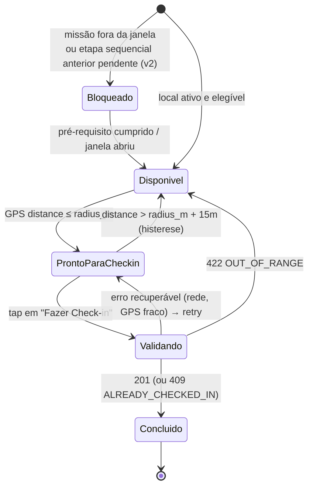
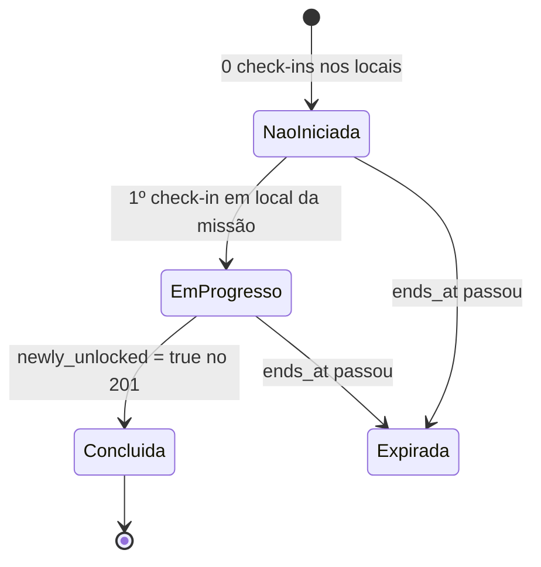

# 05 — Regras de UX e Máquina de Estados

## 5.1 Estados de um Local (a máquina central do app)

O estado exibido de um Local é **derivado, nunca armazenado no cliente**, a partir de
3 entradas independentes:

```
estado = f( servidor: user_status do Local (completed?)        ← API
          , servidor: regras da missão (janela, sequência)      ← API
          , cliente:  distância GPS em tempo real vs radius_m ) ← watchPosition
```



### Tabela de renderização por estado

| Estado | Card (Home/Missão) | Pin (Mapa) | Botão (detalhe) | Microcopy |
|---|---|---|---|---|
| `bloqueado` | Opaco + cadeado | Cinza com cadeado (ou oculto, se `mission_only` de missão futura) | Desabilitado | "Disponível a partir de 01/07" · v2: "Complete a etapa 2 para desbloquear" |
| `disponivel` (longe) | Normal + distância | Cor da categoria/missão | **Desabilitado** + distância + CTA secundário "Como chegar" (deep link Maps) | "Você está a 1,2 km — chegue mais perto para fazer check-in" |
| `pronto_para_checkin` | Realce (borda/glow) | Pin pulsando | **Habilitado**, destaque máximo, pulso sutil | "Você chegou! Faça seu check-in ✅" |
| `validando` | — | — | Spinner, desabilitado (~≤ 2 s) | "Confirmando sua presença…" |
| `concluido` | Check verde + pontos ganhos | Check verde, saturação reduzida | Substituído por selo com data | "Check-in feito em 10/06 · +30 pts" |

Regras transversais:

- **Distância sempre visível** quando fora do raio — o usuário precisa saber *quanto falta*, não só que "não pode". É a defesa nº 1 contra avaliação 1 estrela "o app não funciona".
- **Histerese de 15 m** na saída do raio (doc 03) — sem isso o botão pisca com o jitter do GPS.
- `409 ALREADY_CHECKED_IN` → transita direto para `concluido`, sem mensagem de erro (é retry de uma operação que já deu certo).
- Erro de rede em `validando` → volta para `pronto_para_checkin` com toast "Sem conexão — tente novamente" (nunca fila offline; doc 03).

## 5.2 Estados de uma Conquista (Missão)



| Estado | Card da missão | Comportamento |
|---|---|---|
| `nao_iniciada` | Capa + "5 locais · 350 pts possíveis" + badge em silhueta | CTA "Começar pela mais próxima" |
| `em_progresso` | Barra de progresso "2/5" + badge em silhueta + próximo local pendente mais próximo | Seção da Home ordena estas primeiro |
| `concluida` | Badge colorido + "Concluída em 10/06" + bônus ganho | Vai para a vitrine no perfil; sai do topo da Home |
| `expirada` | Visível só no histórico, com progresso final ("3/5") | Pontos de check-ins feitos são mantidos; bônus não |

**Momento de celebração** (o "core loop" emocional do produto): quando o `201` traz
`newly_unlocked: true`, a sequência é — animação de pontos do check-in → modal
full-screen da conquista (badge + bônus + confete) → CTA "Compartilhar" e "Ver próxima
missão". Tudo com dados da própria resposta do check-in; nenhum request no meio.

## 5.3 Estados de permissão/GPS (pré-requisito de tudo)

| Situação | Comportamento do app |
|---|---|
| Permissão nunca pedida | Pedir **em contexto**: no primeiro tap em "Fazer check-in" ou ao abrir o Mapa — não no onboarding (taxa de aceite muito maior) |
| Permissão negada | App 100% navegável (Home, missões, detalhes). Botão de check-in vira "Ativar localização" → deep link para Ajustes |
| GPS impreciso (`accuracy > 50 m`) | Banner no detalhe: "Sinal de GPS fraco — vá para área aberta". Botão segue habilitado se dentro do raio (o servidor decide; tolerância capada absorve) |
| Localização indisponível (indoor) | Estado `disponivel` com "—" na distância + dica |

## 5.4 Contrato visual entre superfícies

A mesma entidade aparece em 4 superfícies; o estado tem que ser **consistente entre
todas elas na mesma sessão** (cache único por entidade — React Query com chave
`['place', id]` normalizada, atualizada pela resposta do check-in):

```
Home (card avulso)  ─┐
Card da missão       ├──  mesma fonte: cache normalizado por place_id
Pin no mapa          │    (user_status do servidor + distância do GPS local)
Bottom-sheet/detalhe ─┘
```

Anti-padrões que esta arquitetura proíbe:

1. Pin verde no mapa e card "disponível" na Home ao mesmo tempo (cache divergente).
2. Mostrar "3/5" na Home e "2/5" no detalhe da missão (progresso calculado em dois lugares — por isso só o servidor calcula).
3. Botão habilitado fora do raio "para o usuário tentar" (gera 422 e frustração; o servidor rejeitaria de qualquer forma).
4. Conceder pontos otimisticamente antes do 201 (retirar pontos depois é a pior interação possível num produto de gamificação).
