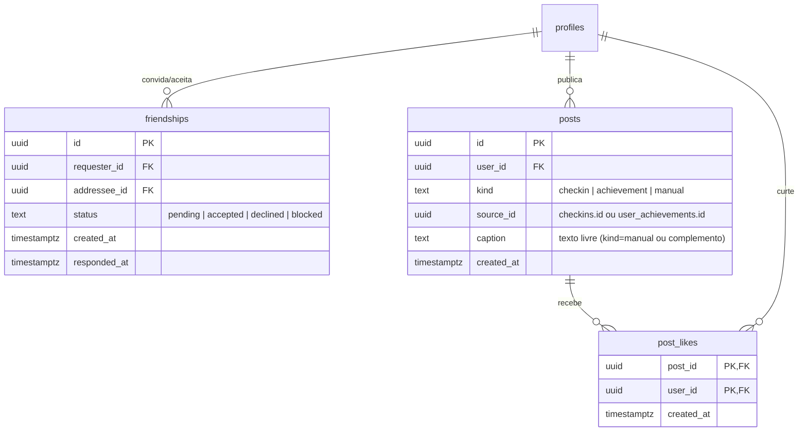

# 06 — Social, Feed, Ranking, Níveis e Ofensiva

> Extensão da arquitetura (docs 01–05) cobrindo os sistemas sociais e de retenção
> validados no protótipo: amigos, ranking, feed, níveis/XP e ofensiva (streak).
> Mantém os princípios do core: ledger imutável, servidor como autoridade,
> estado derivado calculado de eventos.

## 6.1 Modelagem



### `friendships` — grafo simétrico com convite
- Linha única por par (constraint `check (requester_id < addressee_id)` + unique no par,
  guardando quem pediu em `requester_id`): evita pedido duplicado nos dois sentidos.
- Estados: `pending → accepted | declined`. "Sugestões" não são tabela — são uma
  query (amigos de amigos com `count(*)` de mútuos, excluindo pares existentes).
- RLS: cada usuário enxerga linhas onde é requester ou addressee; aceitar/recusar
  via RPC (valida que `auth.uid()` é o addressee).

### Feed: **projeção de eventos, não cópia**
Decisão (espelha o protótipo): check-ins e conquistas **não são duplicados** numa
tabela de feed. O feed é uma união:

```sql
-- posts manuais ∪ check-ins ∪ conquistas dos amigos (e meus)
create view feed_items as
  select 'post' as kind, p.id, p.user_id, p.caption as text, p.created_at
    from posts p where p.kind = 'manual'
  union all
  select 'checkin', c.id, c.user_id,
         null, c.created_at
    from checkins c where c.status <> 'revoked'
  union all
  select 'achievement', ua.id, ua.user_id, null, ua.completed_at
    from user_achievements ua;
```

Por quê: zero risco de feed dessincronizado do ledger (check-in revogado some do
feed automaticamente), e o texto do card é montado na leitura com os joins
(`place.name`, `points_awarded`). Trade-off: a query do feed é mais cara — quando
doer (> dezenas de milhares de usuários), materializa-se `feed_items` com triggers,
sem mudar o contrato da API.

- `post_likes` com PK composta (post_id, user_id) = curtida idempotente; o contador
  é `count(*)` (cacheável). Curtidas em eventos (check-in/conquista) usam o mesmo
  `post_id` lógico prefixado por tipo — no Postgres real, uma tabela
  `likes(target_kind, target_id, user_id)`.

### Ranking — query, não estado
```sql
select u.id, u.name, u.total_points,
       rank() over (order by u.total_points desc) as rank
  from profiles u
 where u.id = $me
    or u.id in (select friend_of($me));  -- amigos aceitos
```
`profiles.total_points` já é cache do ledger (doc 01) → ranking sempre "ao vivo".
Janela semanal (v2): mesma query somando `points_ledger` com `created_at >= date_trunc('week', now())`.

### Níveis e Ofensiva — derivados, com nomes de marca
- **Níveis** são apresentação pura sobre `total_points` (thresholds em config, não em
  tabela): Turista Curioso 0 · Trilheiro Urbano 150 · Nômade do Mapa 400 ·
  Cartógrafo Mestre 800 · Lenda Viva 1500. Pontos exibidos como **PinPoints**.
- **Ofensiva (streak)**: dias consecutivos com ≥1 check-in válido, contando para trás
  a partir de hoje. Calculada por query sobre `checkins` (`distinct date(created_at at
  time zone user_tz)`) — *nunca* armazenada como contador (contador desincroniza com
  revogações; a query não). Estados: ativa hoje · **em risco** (ontem sim, hoje ainda
  não) · quebrada. Push de "ofensiva em risco" às 19h local é o gancho de retenção v1.1.
- Timezone importa: o "dia" do streak é o dia local do usuário (`profiles.tz`),
  não UTC — registrar tz no onboarding.

## 6.2 Contratos de API (adições)

| Método e rota | Descrição |
|---|---|
| `GET /app/v1/feed?cursor=` | Feed dos amigos + meu (projeção; itens com `kind`, `text` montado, `attachment` {emoji, categoria, label}, `likes`, `liked`) |
| `POST /app/v1/feed/{kind}/{id}/like` · `DELETE …/like` | Curtir/descurtir (idempotente) |
| `GET /app/v1/social/ranking?window=all\|week` | Ranking entre amigos com `my_rank` |
| `GET /app/v1/social/friends` | Amigos, pedidos recebidos/enviados e sugestões (mútuos) |
| `POST /app/v1/social/requests` `{user_id}` | Enviar pedido |
| `POST /app/v1/social/requests/{id}/accept` · `/decline` | Responder pedido (só o addressee) |
| `GET /app/v1/me/streak` | `{count, today, at_risk}` (também embutido em `/me`) |

Eventos de produto que cruzam telas (o protótipo já implementa o comportamento):
o `201` do check-in continua sendo a fonte primária; ranking (`my_rank` antes/depois),
nível e streak são recalculados no cliente a partir das respostas — ou empurrados
via Realtime nos canais do usuário.

## 6.3 Regras de UX

| Situação | Regra |
|---|---|
| Check-in/conquista → feed | Publicação automática (projeção). Privacidade v2: flag `share_checkins` no perfil |
| Ultrapassagem no ranking | Toast imediato no check-in ("você passou a Marina!") — recompensa social no momento da ação |
| Ofensiva em risco | Chama apagada + ⚠️ no app; push às 19h local (v1.1); recuperar ofensiva pagando PinPoints é decisão de produto v2 (Duolingo-style) |
| Pedido aceito | Pessoa entra no ranking na hora + toast para ambos |
| Likes | Otimista no cliente (toggle), reconciliado pelo servidor — curtida não é dinheiro, pode ser otimista (diferente de pontos, doc 03) |

## 6.4 Antiabuso social (v1.1)

- Rate limit em pedidos de amizade (N/dia) e likes (N/min).
- Bloqueio (`friendships.status = 'blocked'`) silencioso — bloqueado não descobre.
- Feed só de amigos aceitos (nunca público no v1) → reduz superfície de spam/assédio.
- Denúncia de post manual → fila de moderação no Admin (reaproveita o padrão da fila de fraude, doc 04).
