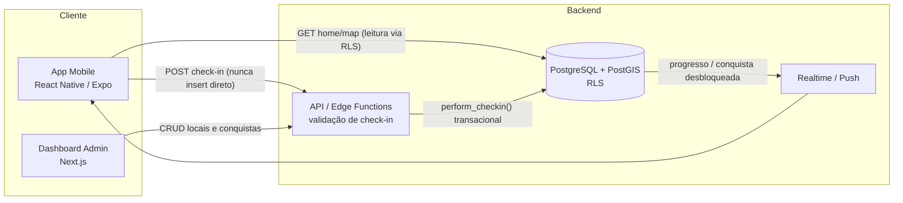

# Arquitetura — App de Gamificação de Viagens

> Documento de arquitetura lógica para o app de gamificação de viagens e experiências
> (modelo "Gymrats para turismo"). Cobre App (usuário final) e Dashboard Admin (gestão de conteúdo).

## Índice

| Documento | Conteúdo |
|---|---|
| [01 — Modelagem de Dados](./01-modelagem-dados.md) | ERD, DDL PostgreSQL/PostGIS, função transacional de check-in |
| [02 — Contratos de API](./02-contratos-api.md) | Endpoints do App e do Admin, payloads, catálogo de erros |
| [03 — Lógica do App (Frente 1)](./03-logica-app.md) | Home, Mapa, geofencing, anti-fraude, progresso de missões |
| [04 — Lógica do Admin (Frente 2)](./04-logica-admin.md) | Wizards de criação, vinculação de locais, ciclo de vida do conteúdo |
| [05 — UX e Máquina de Estados](./05-ux-estados.md) | Estados `bloqueado` / `pronto para check-in` / `concluído`, microcopy |

## Glossário (linguagem ubíqua)

| Termo | Entidade | Definição |
|---|---|---|
| **Local** | `places` | Ponto geográfico com geofence (lat/lng + raio). É a unidade atômica do sistema: todo check-in acontece contra um Local. |
| **Check-in Simples** | `checkins` | Evento de um usuário validado dentro do geofence de um Local. Concede os pontos do Local. |
| **Conquista (Missão)** | `achievements` | Agrupador de N Locais. Progresso = check-ins feitos nos Locais membros. Ao completar, desbloqueia badge + pontos bônus. |
| **Local avulso** | — | Local que não pertence a nenhuma Conquista ativa. Aparece como card individual na Home. |
| **Ledger de pontos** | `points_ledger` | Registro imutável de toda movimentação de pontos (fonte da verdade do score). |

## Visão geral

## Decisões de arquitetura (registro)

| # | Decisão | Escolha | Motivo / trade-off |
|---|---|---|---|
| D1 | Relação Local × Conquista | **N:N** (`achievement_places`) | Um Local pode participar de várias missões ("Igreja da Sé" está em "Centro Histórico" e em "Rota das Igrejas") sem duplicar cadastro nem check-in. |
| D2 | Check-in repetível? | **1 check-in por (usuário, local)** no v1 | Simplifica pontuação e progresso. Repetição (ex.: diária) fica para v2 via campo de cooldown — o modelo já suporta (índice único parcial). |
| D3 | Validação de geofence | **Servidor é a autoridade** (PostGIS `ST_DWithin`); front é só UX | Coordenada enviada pelo cliente é insumo, nunca prova. Toda regra antifraude roda no backend. |
| D4 | Pontuação | **Ledger imutável** + cache denormalizado em `profiles.total_points` | Auditável, permite estorno de fraude sem reescrever histórico, e leitura O(1) do score. |
| D5 | Progresso de missão | **Calculado na transação do check-in** e retornado na resposta | Evita estado derivado dessincronizado; o app nunca calcula regra de negócio, só renderiza. |
| D6 | Check-in via API/RPC | **Nunca insert direto do cliente** (`SECURITY DEFINER` RPC ou Edge Function) | Concentra validação, antifraude, idempotência e desbloqueio de conquista numa transação única. |
| D7 | Local em missão na Home | Aparece **dentro do card da missão**, não duplicado como avulso | Evita poluição da Home; no Mapa todos os Locais ativos viram pin (estilizado por tipo). |
| D8 | Fraude "soft" (mock GPS, velocidade) | **Aceita otimista + flag para revisão** (revogável) | UX fluida no caso legítimo (GPS impreciso é comum em centro histórico); admin revoga depois com estorno via ledger. Fraude "hard" (fora do raio) rejeita na hora. |
| D9 | Edição de missão ativa | **Restringida**; remoção de local re-pontua, conclusão é *grandfathered* | Evita "desconcluir" missão de quem já ganhou o badge — pior UX possível em gamificação. |

## Stack recomendada

Alinhada ao padrão já usado nos projetos do time:

- **App:** React Native (Expo) — `expo-location` para geofencing/`watchPosition`, mapa com `react-native-maps` ou MapLibre.
- **Admin:** Next.js 14 (App Router, Server Actions) + Tailwind/shadcn.
- **Backend:** Supabase — Auth (JWT), PostgreSQL + **PostGIS**, RLS para leitura, **RPC/Edge Function** para escrita de check-in, Realtime para progresso, Storage para fotos/badges.

Os contratos do doc 02 são REST-genéricos: funcionam igualmente com um backend Node/NestJS dedicado se o produto escalar para além do Supabase.

## Roadmap sugerido (GPM hat)

- **v1 (MVP):** check-in simples + missões não-ordenadas "complete todos", ledger, antifraude camadas 1–2, admin CRUD com wizard.
- **v1.1:** revisão de fraude no admin, push "você está perto de um local da missão", missão com janela de datas (sazonais).
- **v2:** missões sequenciais (trilhas ordenadas), "complete X de N", check-in repetível com cooldown, leaderboard, badges colecionáveis desacoplados de missão.
